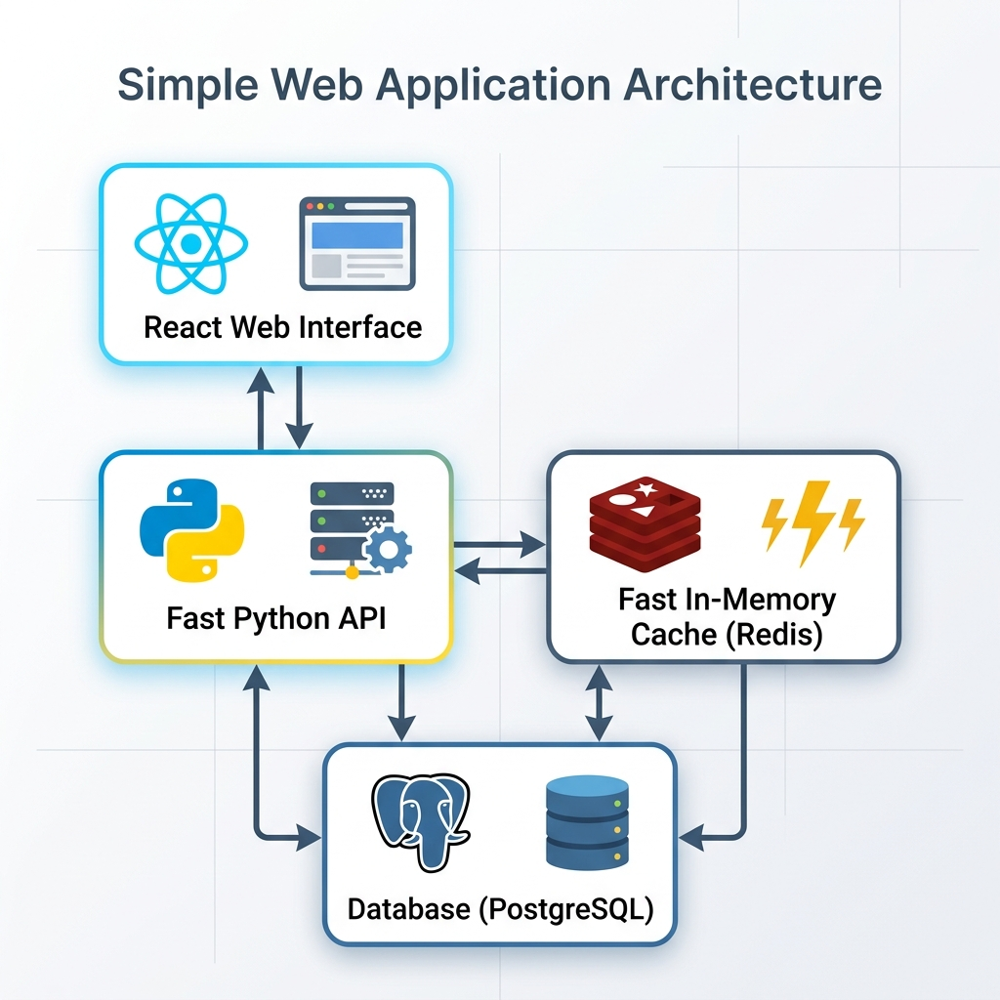

<div align="center">
  

  # CineCore DB
  ### All-in-one Movie Production Tool

  [](https://opensource.org/licenses/MIT)
  [](https://www.python.org/)
  [](https://fastapi.tiangolo.com/)
  [](https://reactjs.org/)
  [](https://redis.io/)

  **A fast and powerful system to manage movie production and sales.**
</div>

---

## What is CineCore DB?

CineCore DB is a complete tool for movie production houses. It helps you manage everything from the first script to the final movie sale.

### How the system works

<div align="center">
  
</div>

---

## Main Features

### 1. Movie Management
*   **Track Progress**: See which stage your movie is in (Pre-production, Shooting, or Finished).
*   **Scripts and Files**: Keep all your scripts and production notes in one place.

### 2. Money and Contracts
*   **Contracts**: Manage deals for actors, crew, and vendors easily.
*   **Budget and Costs**: Track how much you spend and get alerts if you go over budget.
*   **Payments**: Set up and track payment dates as the movie progress.

### 3. People and Locations
*   **Talent Database**: A full list of actors and crew with their details and past work.
*   **Shoot Planning**: Manage filming locations, daily schedules, and government permits.

### 4. Sales and Reports
*   **Deal Tracking**: Keep track of sales to Netflix, Prime, and theaters.
*   **Dashboard**: A single page to see your profit, costs, and performance.

---

## System Speed

CineCore DB is built to be very fast:

*   **Fast Loading**: We use Redis to remember common data, so the app loads quickly even when busy.
*   **Smart Background Work**: The system can do many things at once without slowing down.
*   **Data Safety**: The database handles the important rules to make sure your data is always correct.

---

## How to Set Up

### What you need
*   Python 3.10 or higher
*   Node.js 18 or higher
*   PostgreSQL 14 or higher
*   Redis 6 or higher

### 1. Set up the Backend
```bash
cd Backend
python -m venv venv
source venv\Scripts\activate  # On Mac OS use: venv/bin/activate
pip install -r requirements.txt
python run.py
```

### 2. Set up the Database
Run the scripts in the `DBMS/` folder in this order:
1. `01_stored_procedures.sql`
2. `02_triggers.sql`
3. All the data scripts from `insert_01` to `insert_07`.

### 3. Set up the Frontend
```bash
cd Frontend
npm install
npm run dev
```

---

## License

This project is licensed under the MIT License. See the [LICENSE](LICENSE) file for details.
