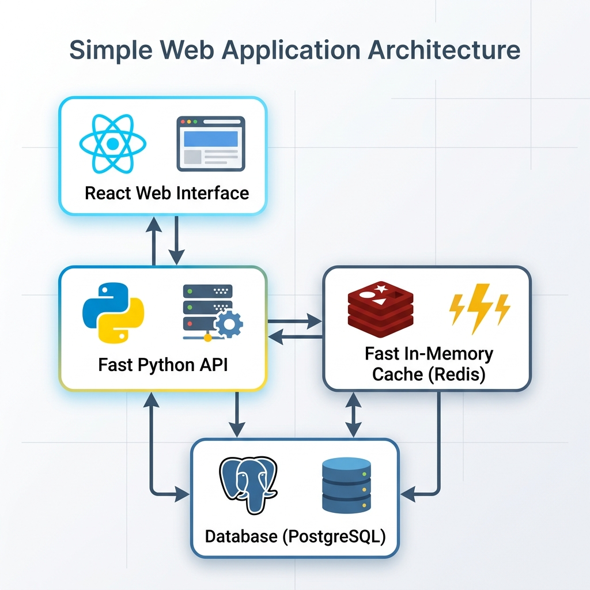

<div align="center">
  
  <h1>CineCore DB</h1>
  <h3>Enterprise-Grade Film Production & Distribution Management System</h3>

  [](https://opensource.org/licenses/MIT)
  [](https://www.python.org/)
  [](https://fastapi.tiangolo.com/)
  [](https://reactjs.org/)
  [](https://postgresql.org/)
  [](https://redis.io/)

  **The central nervous system for modern film studios. Role-based access ensures data integrity from the writer's room to worldwide release.**
</div>

<br />

## 🎬 Overview

CineCore DB is a full-stack, enterprise-level application designed to handle the complex, multi-layered operations of a film production house. Built with a high-performance **FastAPI** backend, a deeply relational **PostgreSQL** database, **Redis** caching, and a cinematic **React 18** frontend, this system tracks every frame, every contract, and every deal.

---

## 🏗️ System Architecture

CineCore is designed using a decoupled, service-oriented architecture ensuring scalability, speed, and strict data security.

*   **Frontend (Client):** A highly interactive, dark-themed cinematic SPA built with **React 18**, **TypeScript**, **Tailwind CSS**, and **Framer Motion**. State and server caching are managed via **React Query**.
*   **Backend (API):** An asynchronous REST API powered by **FastAPI** and **Python 3.10**. It utilizes Pydantic for strict data validation and schema generation.
*   **Database (Persistence):** A deeply relational **PostgreSQL** schema featuring **17 Data Entities**, enforced by database-level constraints, stored procedures, and automated triggers.
*   **Caching (Performance):** **Redis** is integrated into the backend to aggressively cache high-frequency read operations (like analytics and large portfolio queries), drastically reducing database load.

---

## 🔐 Advanced Security & Portfolio Protection

Since this project is designed to be showcased publicly, it features a bespoke **"Demo Mode"** security layer:

*   **Role-Based Access Control (RBAC):** Five distinct portals (`Production Admin`, `Talent Manager`, `Finance Manager`, `Production Manager`, `Distribution Manager`). Each role maps to strict frontend routing and backend endpoint authorization.
*   **Read-Only Demo Mode:** By default, the production environment runs in `DEMO_MODE=True`. All `POST`, `PUT`, `PATCH`, and `DELETE` requests are intercepted.
    *   *Frontend:* Axios interceptors catch mutations, display a seamless "Mocked Success" toast notification, and prevent the network request—giving recruiters a flawless UX without data corruption.
    *   *Backend:* A global FastAPI middleware actively blocks modifying requests with a `403 Forbidden` response to prevent Postman/cURL abuse.
*   **Superadmin Override:** The owner can unlock the database via a hidden `X-Superadmin-Key` header. This persists in local storage, allowing the developer to bypass Demo Mode and safely mutate data in production while navigating as any standard role.

---

## ⚡ Core Capabilities

### 1. Production Logistics
*   **Schedules & Locations:** Smart mapping of shooting schedules with automatic conflict detection.
*   **Permit Tracking:** Government and location permit management with expiration alerts.

### 2. Finance & Contract Engine
*   **Ledger & Overspend Alerts:** Real-time budget tracking. Database triggers automatically alert the Finance Manager if an expense pushes a project over its allocated budget.
*   **Milestone Payments:** Automated splits for actor and vendor contracts tied to production phases.

### 3. Talent & Script Registry
*   **Casting Database:** Centralized registry for cast and crew, linking contracts to specific project roles.
*   **Script Versioning:** Track script drafts and clearance statuses.

### 4. Distribution Matrix
*   **OTT & Theatrical Deals:** Manage platform acquisition deals, licensing periods, and box office aggregations.
*   **Music Rights:** Catalog management for soundtracks and audio licensing.

---

## 🛠️ Technology Stack

| Layer | Technology |
| :--- | :--- |
| **Frontend Framework** | React 18, Vite |
| **Language** | TypeScript (Frontend), Python 3.10+ (Backend) |
| **Styling & Animation** | Tailwind CSS, Framer Motion, GSAP |
| **API Client** | Axios, React Query (TanStack) |
| **Backend Framework** | FastAPI (ASGI) |
| **ORM & Database** | SQLAlchemy (Asyncpg), PostgreSQL 14+ |
| **In-Memory Cache** | Redis 6+ |

### How the system works

<div align="center">
  
</div>


---

## 🚀 Local Development Setup

### Prerequisites
- Python 3.10+
- Node.js 18+
- PostgreSQL (running on port `5432`)
- Redis (running on port `6379`)

### 1. Database Initialization
Ensure PostgreSQL is running. Execute the SQL files located in the `DBMS/` directory in the following order:
1. `01_stored_procedures.sql`
2. `02_triggers.sql`
3. Data insertion scripts (`insert_01` through `insert_07`).

### 2. Backend Setup
```bash
cd Backend
python -m venv venv
source venv/bin/activate  # On Windows use: venv\Scripts\activate
pip install -r requirements.txt
```
*Create a `.env` file in the `Backend` directory:*
```env
DB_HOST=localhost
DB_PORT=5432
DB_NAME=CineCoreDB
DB_USER=postgres
DB_PASSWORD=[PASSWORD]
REDIS_HOST=localhost
REDIS_PORT=6379
DEMO_MODE=True
SUPERADMIN_KEY=[PASSWORD]
```
*Run the server:*
```bash
python run.py
```
*(API will be available at `http://localhost:8000`. Interactive Docs at `http://localhost:8000/docs`)*

### 3. Frontend Setup
```bash
cd Frontend
npm install
```
*Create a `.env` file in the `Frontend` directory:*
```env
VITE_API_URL=http://localhost:8000/api/v1
VITE_SUPERADMIN_EMAIL=[EMAIL_ADDRESS]
VITE_SUPERADMIN_PASSWORD=[PASSWORD]
```
*Run the client:*
```bash
npm run dev
```

---

## 📦 Deployment Guide

Before deploying to production (e.g., Render, Vercel, Netlify), ensure the following:

1. **Frontend:**
   - The build script in `package.json` is set to `"build": "vite build"`.
   - Set the `VITE_API_URL` environment variable in your hosting provider to point to your live backend URL.
2. **Backend:**
   - CORS is configured in `main.py` with `allow_origins=["*"]`.
   - Set the `DEMO_MODE=True` environment variable to protect your production PostgreSQL instance.

---

<div align="center">
  <p><i>"Cinema is a matter of what's in the frame and what's out"</i></p>
  <p><b>© CineCore DB — Built for the reality of production.</b></p>
</div>
